---
date:
  created: 2025-07-25
  updated: 2025-07-31
readtime: 12
author: 杨志恒
tags:
  - 博客
  - 示例
draft: false
---

# Agent 生成 UML 图

本文介绍本人利用 Agent 生成 UML 图的实践经验。

<!-- more -->

## 1.实践背景
7 月 21 组内周会上，leader 建议绘制一个项目的时序图，展示各个系统之间的交互，方便快速了解项目的流程。于是自己尝试利用 Agent 来协助制作了一个时序图，这篇文章用来分享一下利用 Agent 绘制各种 UML 图的实践经验。

## 2.前置环境
(1)Intellij IDEA  
(2)plantuml4idea 插件  
(3)Agent 插件，如：Cursor  
(4)模型选择: claude-sonnet-4  

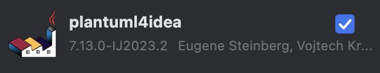

!!! info "注意"
	其中 plantuml4idea 插件需要 Graphviz 的支持，Windows 系统下载插件后就自带 Graphviz，但 Mac 系统需要自行安装，如果已经安装了安装包管理器 Homebrew，可以直接在终端输入:
    ```shell
    brew install graphviz
    ```
    安装完成后，可以通过以下命令验证：
    ```shell
    dot -V
    ```
    输出如图所示：
    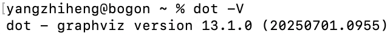

## 3.效果展示

<figure markdown="span">
  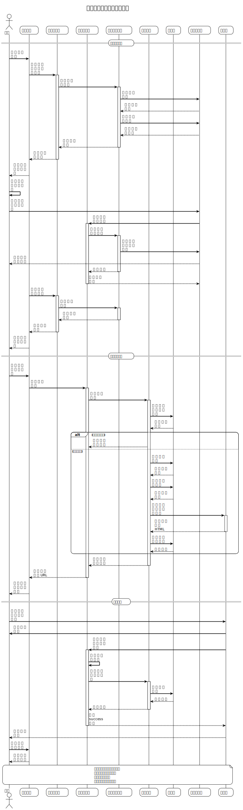
  <figcaption>效果展示图</figcaption>
</figure>

## 4.工作流程

<a id="绘图-Prompt"></a>

### 1) 绘图 Prompt
prompt 模板，可以按需调整：  

```text
你是一个 PlantUML 大师，根据提供的需求和代码生成时序图，使用PlantUML描述：  
1.需求：  
（1）要求体现在 AI 圈人的主流程中，用户、前端、后端、外部系统之间的交互；  
（2）受众是业务或产品人员，不具备系统的研发知识，图里的元素要通俗易懂。  
2.代码：项目代码（最好是把整个项目代码加上，拖动模块即可：client、dao、service、web、pom.xml）。
```
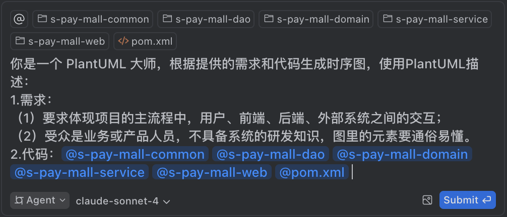

### 2) 交互调整
提交之后 Agent 就会生成 `puml` 文件，然后利用 plantuml4idea 插件就可以进行展示，有时会出现一些语法问题以及图片效果问题，可以通过与 AI 交互 + 自己调整来解决，AI 有时候不能解决问题，需要自己进行调整。
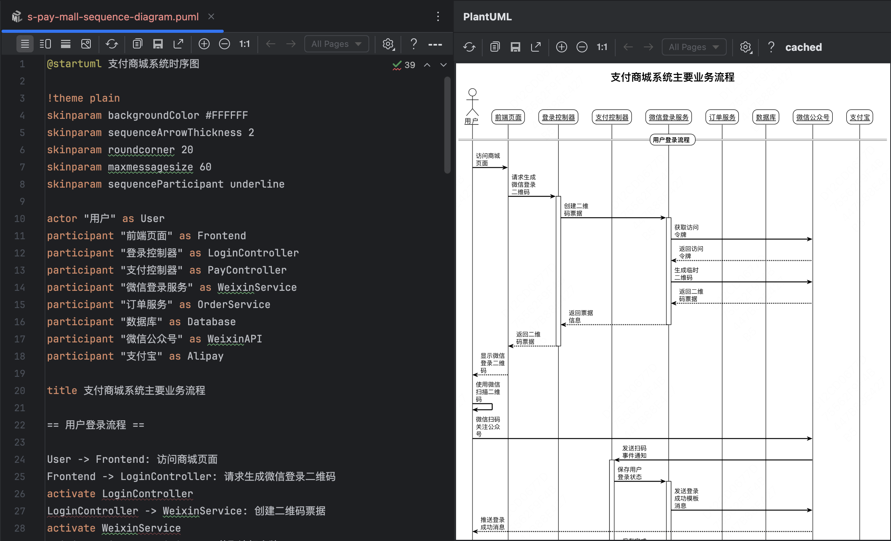

### 3) 实践经验

#### a.UML 图的种类
UML 图的种类参见 [PlantUML 官方主页](https://plantuml.com/zh/)或 [PlantUML Github 主页](https://github.com/plantuml/plantuml)。

#### b.UML 图的颗粒度
UML 图的颗粒度可以通过修改[绘图 Prompt](#绘图-Prompt) 来实现，尽量描述清楚自己的需求，也可以通过多轮交互来丰富 AI 所获得的上下文，此时一个简单的 Prompt 也能获得非常详细的 UML 图。

#### c.图片保存问题
PlantUML插件提供了 2 种保存图片的方式：(1)图片保存功能；(2)复制到剪贴板功能：

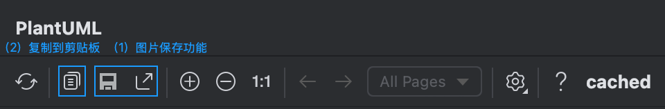

但是保存下来的图片的质量与完整性是与插件界面图片的比例有关的，个人通过实验发现了如何获取最高质量且完整的图片：

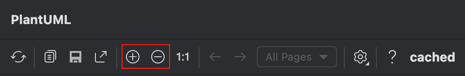

在插件的这个地方，点击 `+` 号，越大越好，然后点击图片保存功能，查看图片，如果不完整，则点击 `-` 号，再次重复流程（可以采用二分法，一次点击多次 `-` 号或 `+` 号），直到某个临界点，会显示完整的图像，并且点击一次 `+` 号会导致图片不完整，恭喜你～:tada:已经得到了这个方法能够获得的最高质量的完整的 UML 图了，这个时候就可以点击图片保存功能来保存 UML 图了。

随后通过查看设置，发现默认保存的图片是 PNG 格式，并且可以替换成 SVG 格式，这样就能保证一定能获得最高质量的图片了，当然如果想保留最高质量的 PNG 图片仍然可以参照上面的流程:arrow_up:，设置保存成 SVG 格式流程如下：

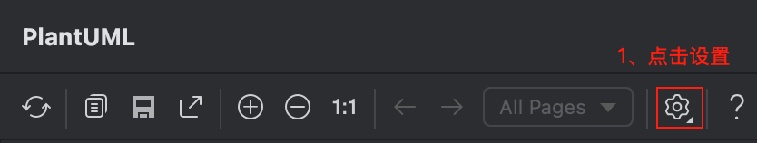

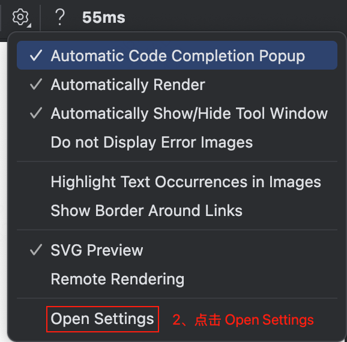

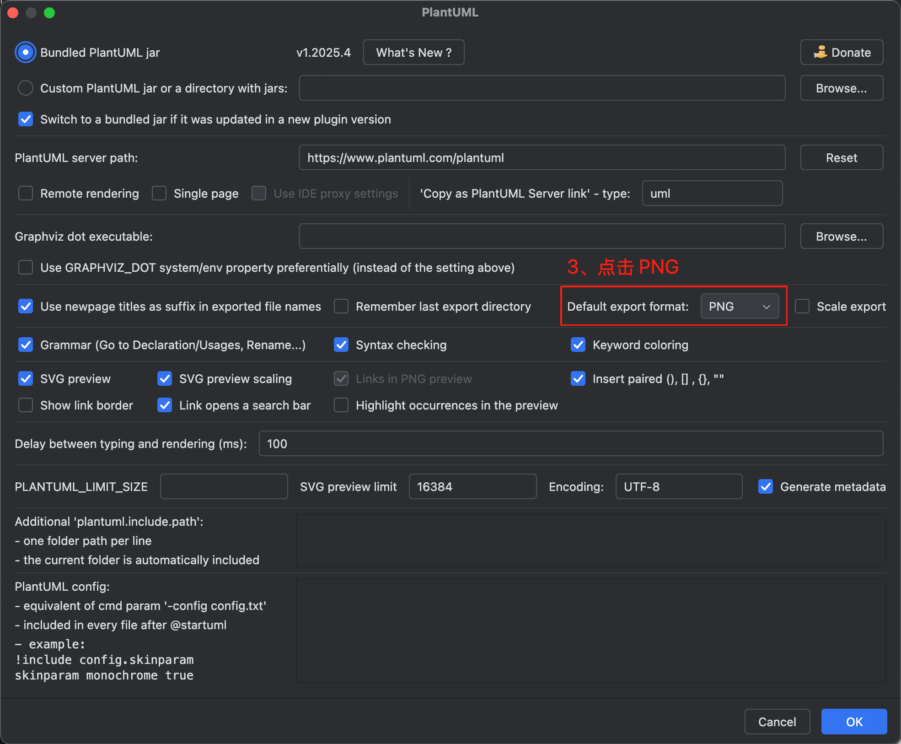

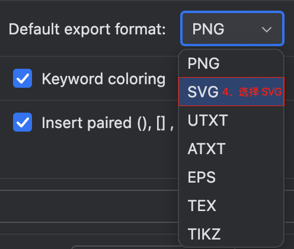

感谢阅读！