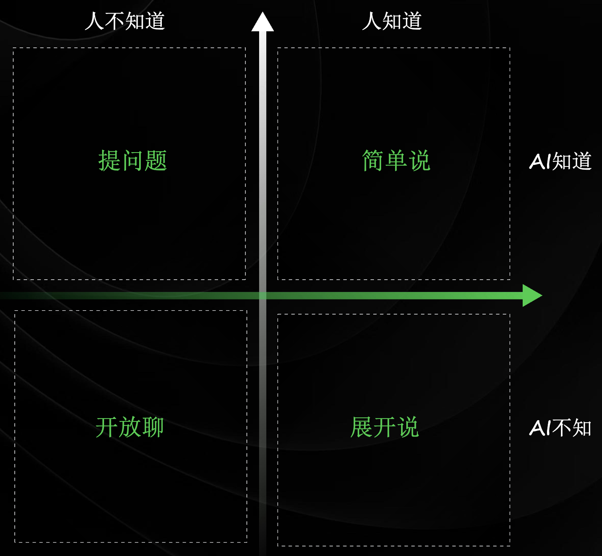

---
date:
  created: 2025-07-31
  updated: 2025-07-31
readtime: 15
author: 杨志恒
tags:
  - 博客
  - 示例
draft: false
---

# Agent 使用经验分享

分享本人在使用 Agent 过程中的经验与收获。

<!-- more -->

## 1.Prompt 设计
在 Prompt 工程中，有一个非常重要的第一性原理——Prompt 存在第一性原理：

「**输入**」是否影响「**输出**」？

换句话说，如果你的 Prompt 存在与否都不影响模型的输出，那说明模型已经在训练阶段内化了该 Prompt 的内容或相关能力，此时该 Prompt 对模型来说是“冗余”的，甚至可以视为“无效”的。

这就引出了一个核心问题——我们与 AI 之间，到底有哪些信息是彼此都清楚的，又有哪些是彼此不了解的？ 不同的信息边界，会直接决定我们如何设计 Prompt，如何与 AI 沟通。

为了更好地理解人与 AI 之间的信息分布和沟通方式，我们可以借用心理学中的**乔哈里视窗**模型：

乔哈里视窗本来是用来帮助我们理解“自我”在自己和他人眼中的不同维度，利用自己知道与否、别人知道与否，把自我认知划分为四个区域：开放区（自己知道，别人知道）、盲区（自己不知道，别人知道）、隐私区（自己知道，别人不知道）、未知区（自己不知道，别人不知道），以及各个区域的内容需要怎么与他人沟通来对齐颗粒度。

类比到人与 AI 也是一样的，可以根据人与 AI 对知识的知道与否，将知识划分为四个象限，在这四个象限内如何与 AI 沟通可以通俗的总结为：简单说（第一象限）、提问题（第二象限）、开放聊（第三象限）、展开说（第四象限）。

**那么该如何设计 Prompt？**（1）对于第一象限，人与 AI 都清楚，不需要多费口舌，也就不需要复杂的 Prompt，只需要简单地向 AI 描述即可；（2）在第二象限，则需要用提问的方式去设计 Prompt；（3）在第三象限则不需要那么注意 Prompt 的结构，尽管大胆开放聊吧！（4）而对于第四象限，由于 AI 并不知道我们的知识内容，所以我们需要将 Prompt 设计得尽可能详细，以让 AI 知晓更多内容。

从体感上以及事实上来说，乔哈里视窗（AI 版）的 X 轴是在不断下移的，AI 知道的越来越多，Prompt 的结构越来越简单，但是 X 轴永远也不会触底，因为有些数据是 AI 始终获取不到的，比如美团内部不对外公开的数据，这部分数据是未来亟待发掘的“金矿”。而 Y 轴是在如何变化的呢？就留给大家自己去思考了～

!!! note "思考"
    个人对于 Y 轴的变化有一些思考，作为抛砖引玉。  
    我认为当前所有人类在 Y 轴上是一个正态分布的情况，而随着 AI 时代的快速发展，这个正态分布会变成 2 个极端，成为一个马鞍形分布。  
    只知道使用 AI 不加以思考的人，会往左边的极端移动，而在使用 AI 的同时，不断思考索取进取，利用 AI 扩大自己的优势的人，将会向右边的极端移动。

显然我们的流程图也是属于乔哈里视图的第四象限，对于“展开说”，如何具体地设计一个好的 Prompt，这里引用 AI 进化论课程的 PPT：

## 2.「协作」而非「索取」
在日常使用 AI 时，我们往往只是把它当作一个工具，单纯地用来完成各类需求。这样的使用方式，容易让我们忽略自身的思考，机械地提出问题，采纳 AI 给出的方案，可以说是一种**「索取」**的形式，这其实是一种不健康的 AI 使用方式，不仅限制了我们自身能力的提升，也难以真正发挥 AI 与人的协同价值。

我认为，在使用 AI 的过程中，我们应当秉持**「协作」**的态度，把 AI 当作真正的**协作伙伴/同事**来看待，并以与同事沟通的高标准与 AI 进行交流。

首先，提问时要站在同事的角度，思考如何让对方更清楚地理解自己的需求，这样 AI 才能更好地回应和帮助我们。其次，在 AI 回答过程中，我们应像认真听同事汇报一样，仔细阅读其输出，主动思考并学习内容，遇到不懂的地方及时追问，确保自己真正获得成长和收获。此外，协作往往需要多轮沟通来达成共识。与 AI 互动时，也要有对齐的意识：AI 可能会出错，正如人一样，我们要及时指出问题，进行修改和微调，并在对话中持续提供反馈和补充信息，让 AI 的输出与我们的需求不断对齐，达到最佳协作效果。

通过协作，AI 与使用者形成了一个动态的工作生态，实现了技术与人的完美结合，创造出超越单独使用任何一方能力的综合效益。
## 3.What's more......
除了我个人分享的这两点，还有很多使用 AI 的思维框架和小技巧，欢迎大家来分享自己的经验～

这里分享一篇写的不错的关于 AI 编程的文章：[AI写代码的“上下文陷阱”：为什么AI总是写错？如何系统性解决？](https://mp.weixin.qq.com/s/dAknYxHhGd0xDNqn9cB73Q)

感谢阅读！
